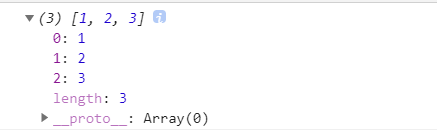
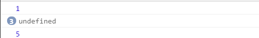
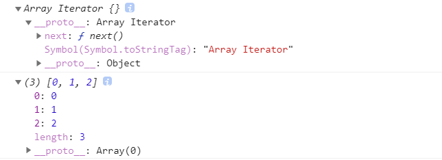
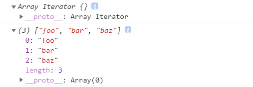
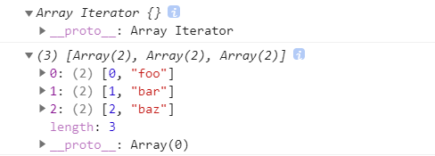
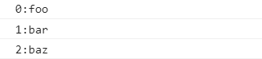

# 集合引用类型

### 1.Object

1. 创建对象的方法

   1. ```javascript
      let person = new Object()
      ```

   2. ```javascript
      let person = {
      	sex: "female",
      	height: 170
      }
      let me = Object.create(person); // 通过create方法，指定me对象的__proto__为person
      ```

   3. ```javascript
      let person = {}；// 对象字面量的方式
      ```

> 在使用对象字面量的表示法定义对象时，并不会实际调用Object构造函数。此过程就是相当于直接执行
>
> person.__ __proto__ __= Object.prototype
>
> 如果执行person__ proto __ = null，那么这个对象将会失去Object.prototype里面的所有方法（toString等）

---


2. 对象属性的读取
   1. 点语法(object.key)
   2. 括号(object[key])

> 括号读取更加灵活，因为可以使用变量读取。

---


### 2. Array

> ES中的数组与一般语言的数组有着区别。ES的数组是动态的，既不需要提前分配空间，也不要求每个元素都是同一个类型的数据（可以a[0]是number，a[1]是对象，a[2]是数组）

1. 创建数组的方式(不含ES6新增方法)：

   1. ```javascript
      let color = new Array(10); // 创建length为10的数组
      let color = new Array("Red", "Pink"); // 已知数组元素
      ```

   2. ```javascript
      let color = Array(10); // 第一种方式的语法糖
      let color = rray("Red", "Pink");
      ```

   3. ```javascript
      let color = ["red", "yellow", "black"];
      ```

2. ES6新增创建数组的静态方法

   1. ```javascript
      // Array.from(): 把一个迭代对象转化成数组
      
      // 第一个参数：类数组对象，任何可以迭代的对象，或者有一个length属性和可索引元素的结构.
      let arrayLikeObject = {
          0: 1,
          1: 2,
          2: 3,
          length: 3
      }
      console.log(Array.from(arrayLikeObject));
      
      //第二个参数：映射函数。这个函数直接增强新数组的值，无需调用map（）创建一个中间数组
      const a1 = [1, 2, 3, 4];
      const a2 = (Array.from(a1, x=>x**2)); // 每个元素都取平方
      console.log(a2); // [1, 4, 9, 16]
      
      // 第三个参数：指定映射函数的this（这里的映射函数不能写成箭头函数的形式）
      const a3 = Array.from(a1, function(x) { return x**this.exp}, {exp: 3}); // 每个数都取三次方
      console.log(a3); // [1, 8, 27, 64]
      ```

   

   > 如果这里没有length属性，那么数组为空，如果索引乱了比如（0，1，3）那么array[2]的值为undefined

   ```javascript
   // Array.of()：把一组参数转换成数组
   const a1 = Array.of(100);
   console.log(a1); // [100]
   ```

   > 与Array()和new Array()方法不同的是传入一个数值也会被当作某个元素来对待，而不是当作length

   3. 数组空位问题

   ES6将空的数组元素设置成undefined，但是ES6之前的某些方法可能会忽略这些空位

   ```javascript
   const options = [1,,,,5];
   for(const option of options) {
   	console.log(option);
   }
   ```

   

> 为了消除这些api区别的对待空位，我们应该显式的设置空元素为undefined

#### 4. 检测数组

1. 只有一个全局执行上下文，也就是Array是同一个对象的话，那么使用（instanceof Array）便可以检测出一个对象是否是数组。
2. 有多个全局执行上下文（多个不同Array对象），那么new出来的数组使用instanceof就可能是false。
3. 为了解决上面的问题，使用Array.isArray()就可以无误的检测

#### 5. 迭代器方法

1. keys( )：返回数组索引的迭代器

   ```javascript
   const a = ["foo", "bar", "baz"];
   console.log(a.keys());
   console.log(Array.from(a.keys()));
   ```

   

2. values( )：返回数组元素的值的迭代器

   ```javascript
   const a = ["foo", "bar", "baz"];
   console.log(a.values());
   console.log(Array.from(a.values()));
   ```

   

3. entries( )：返回索引/值对的迭代器

   ```javascript
   const a = ["foo", "bar", "baz"];
   console.log(a.entries);
   console.log(Array.from(a.entries()));
   ```

   

   ```javascript
   const a = ["foo", "bar", "baz"];
   for(const [index, value] of a.entries()) {
   	console.log(`${index}:${value}`);
   }
   ```

   

> 利用数组的解构，可以轻松提取出索引和值。

#### 6.赋值和填充方法

