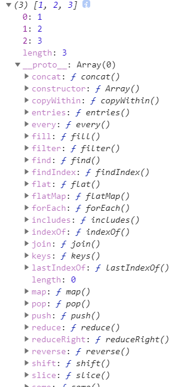
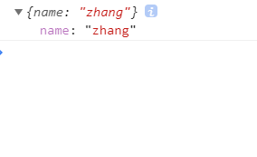
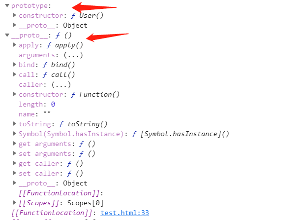
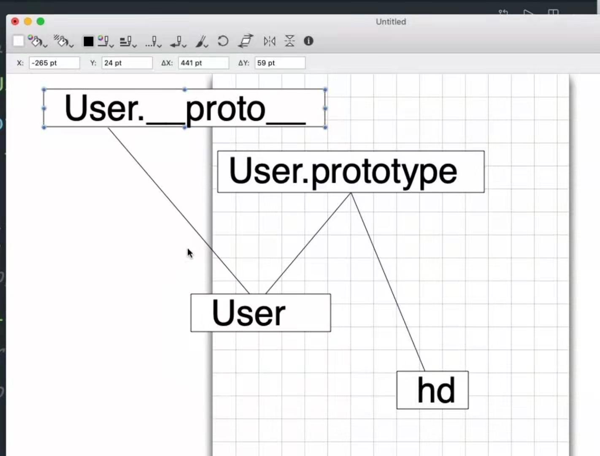
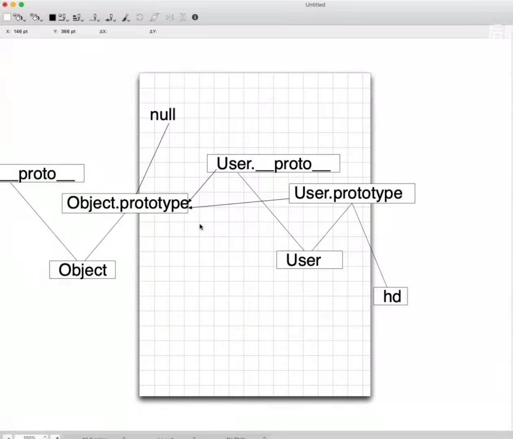
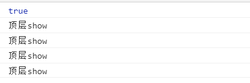
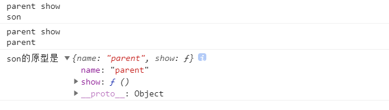

# 原型链和继承

#### 一、原型初体验

> 通过原型实现继承，class是一种语法糖，但是其内部还是通过原型实现的。

```javascript
let arr = [1, 2, 3];
console.log(arr);
```



```javascript
let a = {};
let b = {};
let arr = [1, 2, 3];
console.log(Object.getPrototypeOf(a) == Object.getPrototypeOf(b));
// true
console.log(Object.getPrototypeOf(a) == Object.getPrototypeOf(arr));
// false
console.log(Object.getPrototypeOf(a) == a.__proto__);
// true
```

---

#### 二、存在没有原型的对象

> 完全数据字典对象

```javascript
let expObject = Object.create(null, {
	name: {
		value: "zhang"
	}
})
console.log(expObject);
```



> 这个对象就没有__ proto __属性（也就是没有原型对象）

---

#### 三、原型方法和对象方法优先级

优先使用自己的方法，如果没有那就沿着原型链找。

---

#### 四、函数拥有多个长辈

```
function User() {};
console.dir(User);
```





> 各个长辈的作用不同

```javascript
function User() {};
User.prototype.show = function() {
	console.log("prototype show");
}
User.__proto__.show = function() {
	console.log("__proto__ show");
}
// 实例化对象
let hd = new User();
hd.show(); // prototype show
User.show(); // __proto__ show
console.log(hd.__proto__ == User.prototype); // true
```

- 当这个函数作为一个构造函数时，其实例化对象和该构造函数共享一个原型（prototype）（hd. ____proto____ == User.prototype）
- 当然，他也有自己的____proto____属性。可以参考下图。



---

#### 五、原型之间的关系(Object和普通构造函数)



```javascript
function User() {};

Object.prototype.show = function() {
console.log("顶层show");
}

// 三者相同
let same = (Object.prototype == User.__proto__.__proto__) && (User.prototype.__proto__ == User.__proto__.__proto__) ;
console.log(same);

let tom = new User();
User.prototype.show();
User.__proto__.show();
tom.show();
User.show();
```



---

#### 六、系统构造函数的原型体现

```javascript
let arr = [];
console.log(arr.__proto__ == Array.prototype);

let reg = /a/g;
console.log(reg.__proto__ == RegExp.prototype);
```

---

#### 七、自定义对象原型设置方式

```javascript
let son = {name: "son"};
let parent = {name: "parent"};
parent.show = function() {
console.log("parent show\n" + this.name)
}
// 设置原型
Object.setPrototypeOf(son, parent);
son.show();
parent.show();

console.log("son的原型是",Object.getPrototypeOf(son));
```



---

#### 八、原型链检测

1.  instanceof（是否是实例）

> 表示构造函数和对象之间的关系

 ```javascript
function A() {};
function B() {};
function C() {};

let c = new C();
B.prototype = c;

let b = new B();
A.prototype = b;

let a = new A();

console.log(a instanceof C); //true
console.log(a instanceof B); // true
console.log(a instanceof A); // true

 ```

2. Object.isPrototypeOf（是否是原型）

> 表示对象和对象的关系

```javascript
let a = {};
let b = {};
let c = {};
Object.setPrototypeOf(a, b); // 将a的prototype设置成b
Object.setPrototypeOf(b, c);

console.log(b.isPrototypeOf(a));
console.log(c.isPrototypeOf(a));
console.log(c.isPrototypeOf(b));
```

3. in和hasOwnProperty

> in 会遍历整个原型链，而hasOwnProperty

```javascript
let a = {name: "zbs"};
let b = {sex: "female"};
Object.setPrototypeOf(a, b); // a.prototype = b
console.log("sex" in a); // true
console.log(a.hasOwnProperty("sex")); // false
```

---

#### 九、call和apply

