# 正则表达式

引例：如何从一串字符数字混合的字符串中挑出数字？

1. ```javascript
   let str = "fdafasdf5ds3acx1z12";
   let [...str] = str.filter(a => !Number.isNaN(parseInt(a)));
   console.log(str.join(""))
   // 53112
   ```

2. ```javascript
   let str = "fdafasdf5ds3acx1z12";
   console.log(str.match(/\d/g).join);
   //53112
   ```

#### 一、字面量创建正则表达式

```javascript
// 字面量的形式创建
let com = "baidu.com";
console.log(/o/.test(com));// true
```

> 通过字面量的形式创建正则表达式： /正则/
>
> 缺点：不够灵活，但是可以通过下面的方式创建。

 ```javascript
let com = "baidu.com";
let charc = "b"; // 检测有无b
console.log(eval(`/${charc}/).test(com));
// true
 ```

#### 二、对象创建正则表达式

```javascript
let str = "fda4f5a125f4\\'.'";
let a = "u";
let reg = new RegExp(a, "g");
console.log(reg.test(str));
// false

reg = new RegExp(/f/, "g"); // 也可以输入字面量正则表达式
```

#### 三、选择符

```javascript
let tel = 010-1234567;
console.log(/(010|020)\-\d{6, 7}/);
```

> |：表示或，其中一个满足即可

#### 四、原子表([ ])和原子组( () )

原子表

```
let reg = /[123456]/; 
let hd = "0023";
console.log(hd.match(reg)); // 找出第一个1或者2等等
```

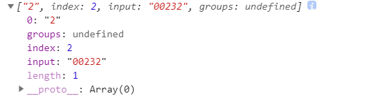

原子组

```
let reg = /(12|34)/;
let hd = "001234";
console.log(hd.match(reg));
```

#### 五、转义(\\)

```
let price = 12.23;
let reg = new RegExp("\\d+\\.\\d");
console.log(reg.test(price));
```

> 这里" \\\d+\\\\.\\\d " 经过转义 \d+\\.\\d

#### 六、字符边界约束

> 起始边界

```javascript
let reg = /^z/;
let str = "zippo";
reg.test(str); //true
```

> 末尾边界

```javascript
let reg = /z$/;
let str = "zippoz";
reg.test(str); //true
```

> 区域

```
// 3到6位字母
let str1 = "112fdsa"
let str2 = "112fff";
let str3 = "11";

str1.match(/^[a-z]{3,6}$); // false
str2.match(/^[a-z]{3,6}$); // true
str3.match(/^[a-z]{3,6}$); // false
```

**注意： /^[a-z]{3.6}/ 这种方式无法保证字符串只有3-6位字母，只能保证它有3-6位字母**


#### 七、元字符

- \d：数字

```javascript
// \d ：数字
let hd = "www 2010 2011";
hd.match(/\d+/g);
```

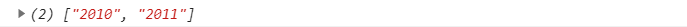

- \D：除了数字

```javascript
// \D：除了数字
let hd = "www 2000 2010";
hd.match(/\D+/g);
```

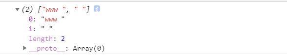

- [^]：除了原子表里面的元素

```javascript
let hd = "张三: 010-8888888; 李四: 020-8888887";
console.log(hd.match(/[^-\d;:]+/g));
// 在原子表中的^表示除了后面的元素
```

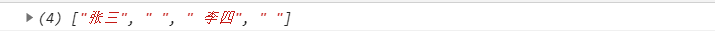

- \s：空白

```javascript
// \s：空白（tab符、space、enter）
console.log(/\s/.test('ab c'));  // true
console.log(/\s/.test('\naaa')); // true
console.log(/\s/.test('aaa')); // false
```

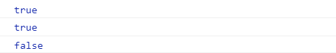

- \S：除了空白

```javascript
// \S：除了空白
console.log(/\S/.test("aa")); // true
console.log(/\S/.test("\n   ")); // false
```

- \w：字母、数字、下划线

```javascript
// 简单的邮箱验证
let email = "22232745109@qq.com";
let reg = /^\w+@\w+\.\w+$/;
console.log(reg.test(email)); // true
```

- \W：除了字母、数字、下划线

```javascript
let username = abcdef;
console.log(/^[a-z]\W{4, 9}$/.test(username));
```

- . :    除了换行符

```
let empty = `
`;
console.log(empty.match(/./));
```


> 如果只是单纯的想要匹配 . 这个字符那么就要使用\转义字符代替。

小技巧匹配所有字符

```
/[\d\D]+/
```

---

#### 八、匹配模式

- i：不区分大小写

```javascript
let hd = "Uuaau";
console.log(hd.match(/u+/i));
```

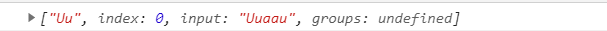

* g：全局匹配（匹配多个）

```javascript
let hd = "Uuaau";
console.log(hd.match(/u+/ig));
```


- m：多行匹配(每一行单独处理)

```javascript
let hd = `
#1 js, 200元 #
#1 java, 500元 #
#1 php, 100元 # 某某某
#1 python, 50元 #
`;
console.log(hd.match(/^\s*#\d+\s+.+\s+#$/gm));
let lessons = hd.match(/^\s*#\d+\s+.+\s+#$/gm).map(v => {
v = v.replace(/\s*#\d+\s*/, '').replace(/\s+#/, "");
[name, price] = v.split(',');
price = price.replace(/^\s+/, "");
return {name, price}
})
console.log(lessons);
```

---

#### 九、中文与字符属性

```javascript
let hd = "wteam2021.不断进步，加油！";
// {} 里面的内容表示属性，L表示字符， P表示标点符号。
// 这里的u表示采用unicode编码的。
console.log(hd.match(/\p{L}/gu)); // 匹配字符
console.log(hd.match(/\p{P}/gu)); // 匹配标点符号
console.log(hd.match(/\p{sc=Han}/gu)); // 匹配汉字
```

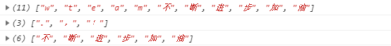

> 字符不定长问题：
>
>  由于字符（特殊）不定长，有些系统没有采用宽字节的匹配方式就可能造成匹配不到位，加一个u修饰符就可以解决。

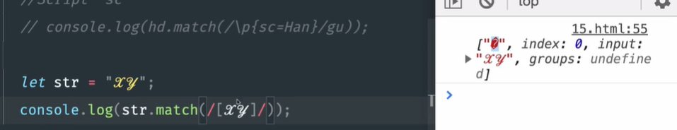

---

#### 十、lastIndex属性（控制正则表达式开始搜索的位置）

```javascript
let hd = "houdunren";
let reg = /\w/g;
console.log(reg.lastIndex);
console.log(reg.exec(hd));
console.log(reg.lastIndex);
console.log(reg.exec(hd));
```

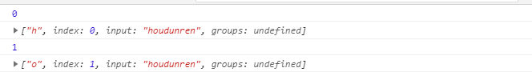

> lastIndex保存着上一次检索的位置。

**如果没有g那么情况就不一样 **

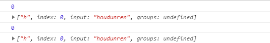

```javascript
let hd = "houdunren";
let reg = /\w/g;
while((res = reg.exec(hd))) {
console.log(res);
}
```

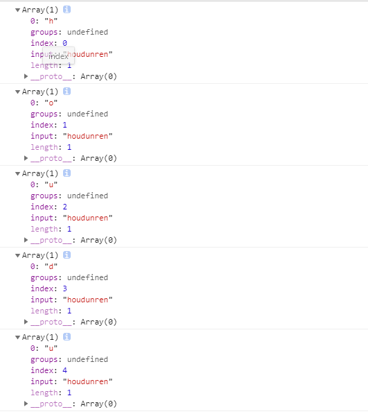